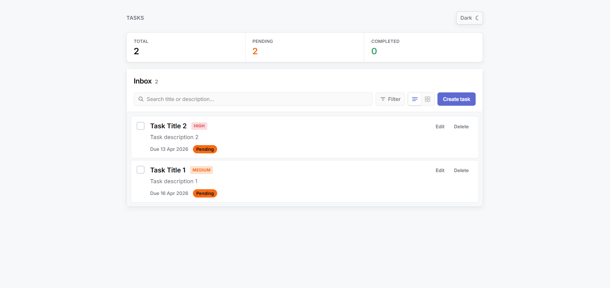
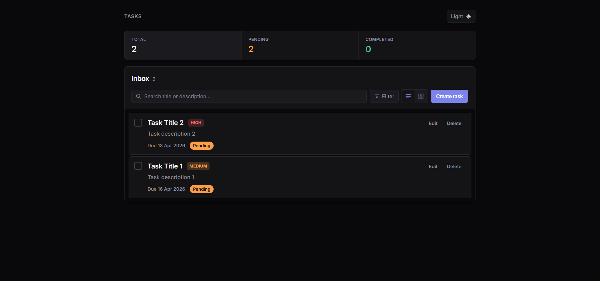
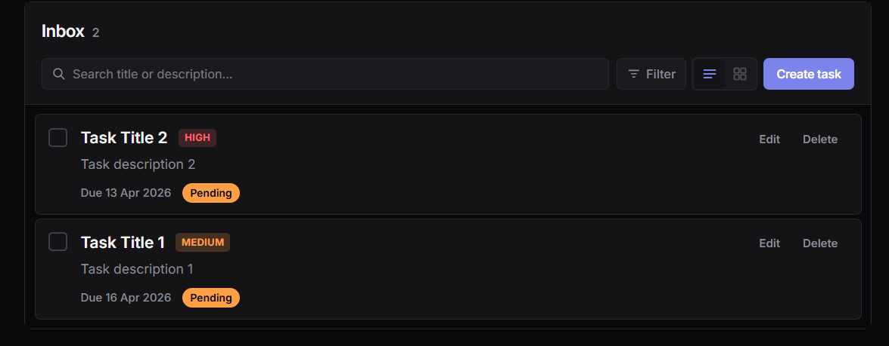
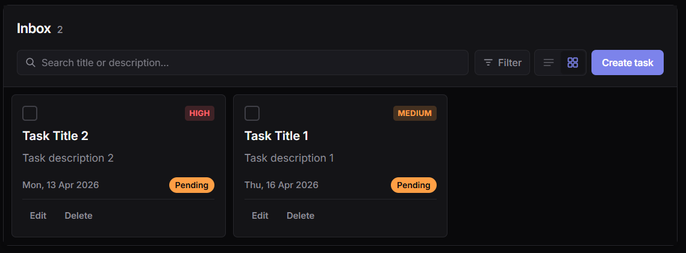
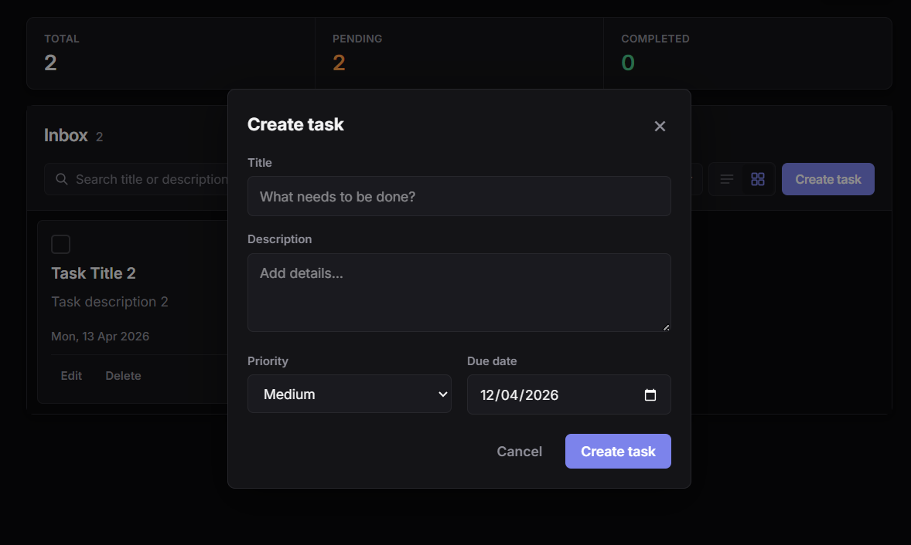
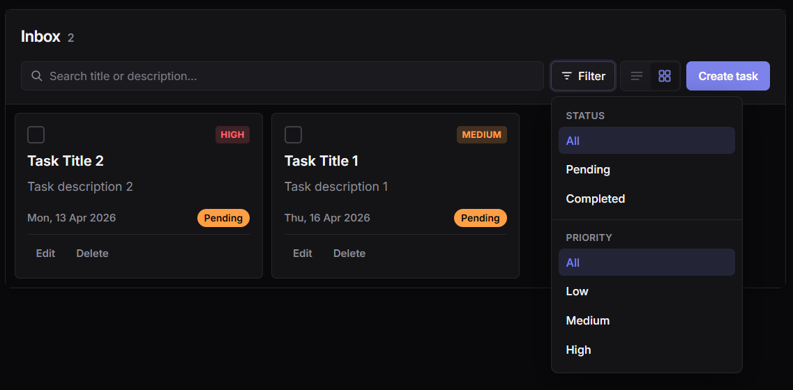
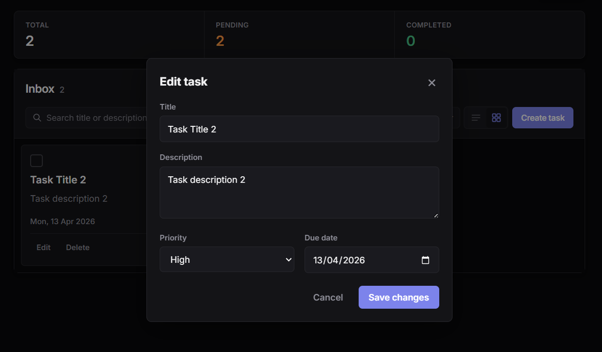

# Task Management Dashboard

A simple task board built with **React** and **TypeScript**. You can add, edit, and delete tasks; search and filter them; switch between list and card views; use light or dark mode; and your data is saved in the **browser** (no server required).

## Live demo

**Production:** **[https://task-management-app-rayhan.netlify.app/](https://task-management-app-rayhan.netlify.app/)**

---

## What you’ll find here

| Topic | Section |
|--------|---------|
| Hosted app | [Live demo](#live-demo) |
| AI insights (Hugging Face) | [AI insights](#ai-insights-hugging-face) |
| How to install and run the app | [Setup](#setup) |
| Pictures of the UI | [Screenshots](#screenshots) |
| Why things are built this way | [Design decisions](#design-decisions) |

**Try it quickly:** open a terminal in this folder, run `npm install`, then `npm run dev`, and visit the address shown (often **http://localhost:5173**).

---

## AI insights (Hugging Face)

The **AI overview** panel summarizes your current task list and suggests what to focus on next. It calls the [Hugging Face Inference Providers](https://huggingface.co/docs/inference-providers/en/index) OpenAI-compatible router (`/v1/chat/completions`).

**Setup**

1. Create a token at [Hugging Face Settings → Access Tokens](https://huggingface.co/settings/tokens) with permission to **make calls to Inference Providers**.
2. Copy [`.env.example`](.env.example) to `.env` and set `HF_ACCESS_TOKEN=hf_...`.

**Important:** The token is injected by the **Vite dev server proxy** only (see [`vite.config.ts`](vite.config.ts)). It is **not** embedded in the client bundle. Run `npm run dev` locally to use AI insights. A static deploy (e.g. Netlify) has no proxy unless you add your own backend.

The app picks a chat model Hugging Face can route through **your enabled Inference Providers** (see [Inference Provider settings](https://huggingface.co/settings/inference-providers)): it starts with `openai/gpt-oss-120b:preferred` (suffix `:preferred` = use your preferred-provider order), then automatically tries other models if you get errors like “not supported by any provider you have enabled”.

Optional: set `VITE_HF_CHAT_MODEL` in `.env` to a specific model id (you can append `:groq`, `:fastest`, etc., as in the [Inference Providers docs](https://huggingface.co/docs/inference-providers/en/index)).

---

## Table of contents

- [Live demo](#live-demo)
- [What you’ll find here](#what-youll-find-here)
- [AI insights (Hugging Face)](#ai-insights-hugging-face)
- [Setup](#setup)
- [Screenshots](#screenshots)
- [Design decisions](#design-decisions)
- [Technical stack](#technical-stack)
- [Features](#features)
- [Scripts](#scripts)
- [License](#license)

---

## Setup

### What you need

- **Node.js** version 20 or higher ([download](https://nodejs.org/))
- **npm** (it comes with Node)

Check that they work:

```bash
node -v
npm -v
```

### Install packages

In the project folder (where `package.json` is):

```bash
npm install
```

### Run during development

```bash
npm run dev
```

Your browser should use the URL printed in the terminal—usually **http://localhost:5173**.

**Windows:** if PowerShell blocks `npm`, try:

```powershell
npm.cmd run dev
```

### Build for production

```bash
npm run build
```

This checks types and builds the site. The output goes to the **`dist/`** folder.

### Preview the production build

```bash
npm run preview
```

This serves `dist/` locally so you can test the built app.

### Check code style

```bash
npm run lint
```

---

## Screenshots

These images live in **`docs/Screenshots/`** so they show up when you view this file on GitHub.

### Main screen

| Light mode | Dark mode |
|------------|-----------|
|  |  |

### List and cards

| List view | Card view |
|-----------|-----------|
|  |  |

### Create task and filters

| New task window | Filter menu |
|-----------------|-------------|
|  |  |

### Edit task

| Edit window |
|-------------|
|  |

---

## Design decisions

1. **One main workspace**  
   Everything happens in a single **Inbox** area: counts at the top, then a row for search, filters, switching list vs cards, and a clear **Create task** button. The idea is to keep the screen easy to read at a glance without clutter.

2. **Colors via CSS variables + Tailwind**  
   Light and dark colors are defined once in `src/index.css` on `:root[data-theme="light"]` and `:root[data-theme="dark"]`. The UI uses Tailwind classes with values like `bg-[var(--surface)]`, so changing theme updates the whole app without duplicating long color lists in two places.

3. **Correct theme on first load**  
   Before React starts, `src/main.tsx` reads saved preference (or the system dark/light setting) and sets `data-theme` on the `<html>` element. That reduces a bright flash when you prefer dark mode. After that, the `useTheme` hook keeps the toggle, the page, and saved settings in step.

4. **All task logic in one place**  
   The `useTasks` hook loads tasks from `localStorage`, checks that saved data looks valid, saves after every change, and creates new IDs with `crypto.randomUUID()`. That keeps add / update / delete logic in one file instead of spreading it across many components.

5. **Forms controlled from the parent**  
   Values for “create” and “edit” live in the main dashboard component and are passed into the modals. That way opening “edit” always shows the latest task data and you don’t need extra effects to copy props into local state.

6. **Filters behind a button**  
   Priority filters open in a small panel when you click **Filter**, so the top bar stays short on phones and small tablets. A dot on the button hints when a filter is active. Active vs completed work is split via the **Dashboard** / **Completed tasks** navigation.

7. **Basic accessibility**  
   Dialogs use proper roles and labels, you can click the dimmed background to close, and **Escape** closes them. The search box has a label for screen readers even though it’s visually compact.

8. **No backend**  
   Tasks and theme choice are stored only in **`localStorage`**. The app runs entirely in the browser—good for a demo or personal use. Sharing data between devices would need a server or cloud sync later.

9. **Static hosting**  
   The production build is plain HTML/CSS/JS in `dist/`. [`netlify.toml`](netlify.toml) and [`public/_redirects`](public/_redirects) configure the Netlify deploy (build command, output folder, and SPA routing so refreshes keep working).

10. **AI routing (dev + Netlify)**  
   The browser calls relative `/hf-api/...`. **Locally**, Vite’s proxy forwards to `https://router.huggingface.co` and attaches `Bearer HF_ACCESS_TOKEN` from your `.env`. **On Netlify**, [`netlify/functions/hf-proxy.mjs`](netlify/functions/hf-proxy.mjs) does the same—the token stays in **Site configuration → Environment variables** as **`HF_ACCESS_TOKEN`** (never in the frontend bundle). Add the variable and **redeploy** after `netlify.toml` / redirects include the `/hf-api/* → hf-proxy` rule before the SPA `/* → index.html` rule.

---

## Technical stack

| Part | Technology |
|------|------------|
| Build tool | [Vite](https://vite.dev/) |
| UI library | [React 19](https://react.dev/) |
| Language | [TypeScript](https://www.typescriptlang.org/) |
| Styling | [Tailwind CSS v4](https://tailwindcss.com/) (`@tailwindcss/vite`) |
| Saving data | Browser `localStorage` |

---

## Features

- Task fields: **title**, **description**, **priority**, **due date**, and **done / not done**
- **Create** tasks in a popup, **edit** in a popup, **delete** with a confirmation step
- **Search** by title or description
- **Filter** by priority
- **List** or **card** layout
- **Counters** for total, pending, and completed tasks
- **AI overview**: Hugging Face chat summarization and recommendations (needs `HF_ACCESS_TOKEN`; Vite proxy in dev, Netlify function [`hf-proxy`](netlify/functions/hf-proxy.mjs) in production)
- **Enhance with AI** on create/edit: same routing as insights
- **Light** and **dark** theme, remembered when you come back
- Layout that works on **large and small** screens

---

## Scripts

| Command | What it does |
|---------|----------------|
| `npm run dev` | Start the dev server with live reload |
| `npm run build` | Typecheck + build static files to `dist/` |
| `npm run preview` | Serve `dist/` locally |
| `npm run lint` | Run ESLint |

---

## License

MIT
